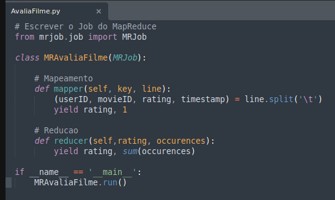
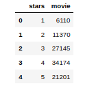
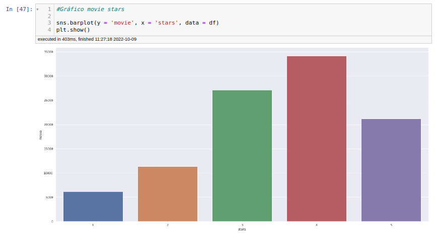
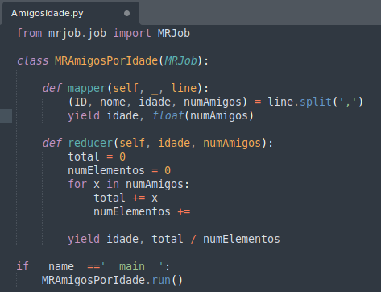

# Trabalhando com MapReduce

[Hadoop MapReduce](https://hadoop.apache.org/docs/r1.2.1/mapred_tutorial.html#Overview) é uma estrutura de software para escrever facilmente aplicativos que processam grandes quantidades de dados (conjuntos de dados de vários terabytes) em paralelo em grandes clusters (milhares de nós) de hardware comum de maneira confiável e tolerante a falhas.

Um trabalho MapReduce geralmente divide o conjunto de dados de entrada em partes independentes que são processadas pelas tarefas de mapa de maneira completamente paralela. A estrutura classifica as saídas dos mapas, que são então inseridas nas tarefas de redução . Normalmente, tanto a entrada quanto a saída do trabalho são armazenadas em um sistema de arquivos. A estrutura se encarrega de agendar tarefas, monitorá-las e reexecutar as tarefas com falha.

### Problema de negócio

***1. Identificar através de uma base de dados: Quantos filmes tiveram de 1 a 5 estrelas?***

Baixar um conjunto de dados do [site](https://grouplens.org/datasets/movielens/). 

##### Nota:A GroupLens Research coletou e disponibilizou conjuntos de dados de classificação do site MovieLens (https://movielens.org). Os conjuntos de dados foram coletados em vários períodos de tempo, dependendo do tamanho do conjunto.

##### Executar o job MapReduce:

Ao baixar o arquivo copiar para o HDFS:

##### Copiar o arquivo para o HDFS 
hdfs dfs -put u.data /mapred

#### Executar o Job MapReduce

#### Executar o MapReduce ao dataset em um cluster Hadoop

python AvaliaFilme.py hdfs:///mapred/u.data - r hadoop

#### Resultado 

***2. Gerar Média de Amigos no Facebook por Idade***

# Copiar o arquivo para o HDFS
hdfs dfs -put Datasets/amigos_facebook.csv /mapred

#### Executar o Job MapReduce

# Processar o Job mapReduce
python Analytics/AmigosIdade.py hdfs:///mapred/amigos_facebook.csv -r hadoop
